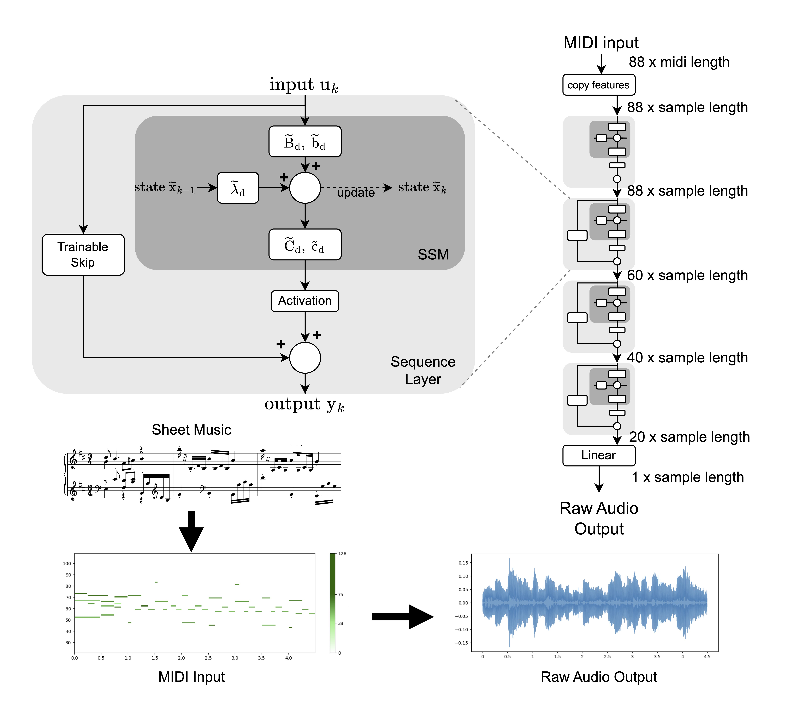

# Piano-SSM: Diagonal State Space Models for Efficient MIDI-to-Raw Audio Synthesis

[DAFx25 Paper](https://dafx25.dii.univpm.it/wp-content/uploads/2025/07/DAFx25_paper_57.pdf)

**Authors**: Dominik Dallinger, Matthias Bittner, Daniel Schnöll, Matthias Wess, and Axel Jantsch  
[Christian Doppler Laboratory for Embedded Machine Learning](https://www.tuwien.at/en/cdl/eml)

Introduces Piano-SSM, a compact and efficient diagonal State-Space Model architecture that synthesizes raw piano audio directly from MIDI in real time—with minimal domain knowledge and variable sampling-rate support.

[**Audio Samples 🔈**](https://domdal.github.io/piano-ssm-samples/)

Piano-SSM build on the S-Edge [paper](https://link.springer.com/article/10.1007/s10994-025-06807-z) with some changes in the layer structure -- see submodule S-Edge_PianoSSM


The Piano-SSM architecture. The model processes 88
MIDI input channels, which are progressively reduced through
SSM layers to 20 latent dimensions. A final linear layer maps this
representation to a single raw audio output channel.

## Setup

- Python 3.12.3
- CUDA Version: 12.9

Install dependencies using pip:

```bash
pip install -r requirements.txt
```

## Training

Use the `train.py` script to train Piano-SSM models on MIDI-to-audio synthesis tasks. 
python train.py \
 
### Parameters

#### Core Training Parameters
- `--epochs`: Number of training epochs (default: 50)
- `--batch_size`: Training batch size (default: 2)
- `--lr`: Learning rate (default: 0.0001)
- `--sample_length`: Length of audio samples in seconds (default: 4.0)
- `--epoch_size`: Number of samples per epoch (default: 20)
- `--step_size`: Gradient accumulation steps (default: 0 - immediate updates)

#### Dataset Configuration
- `--dataset`: Dataset type - `maestro` or `maps` (default: "maestro")
- `--dataset_path`: Path to dataset directory (default: "data/")
- `--train_year`: Year filtering for training data (default: "single")
  - Options (MAESTRO): 2004, 2006, 2008, 2009, 2011, 2013, 2014, 2015, 2017, 2018, "all", "single"
  - Options (MAPS): "ambient", "close", "all"
- `--test_year`: Year filtering for test data (default: "single")
  - Options (MAESTRO): 2004, 2006, 2008, 2009, 2011, 2013, 2014, 2015, 2017, 2018, "all", "single"
  - Options (MAPS): "ambient", "close", "all"

#### Model Architecture
- `--model`: Model architecture (default: "PianoSSM_S")
  - Options: PianoSSM_S, PianoSSM_L, PianoSSM_XL (add _MH for multi-head variants)
  multi-head is used to deal with the different years of MAESTRO
- `--activation`: Activation function (default: "Tanh")
  - Options: ReLU, LeakyReLU, Identity, Tanh

#### Audio Processing
- `--sample_rate`: Audio sample rate (default: 16000)
  - Options: 16000, 24000, 44100
- `--midi_rate`: MIDI sampling rate (default: 1000)
  - Must be divisible by sample_rate. Common pairings:
    - 16000 Hz audio → 1000 Hz MIDI
    - 24000 Hz audio → 1200 Hz MIDI  
    - 44100 Hz audio → 1764 Hz MIDI
- `--dilation`: Dilation factor for data processing (default: 4.0)
- `--normalize`: Enable audio normalization (default: True)

#### Loss Functions
- `--criterion`: Loss function(s) to use (default: ["CombinedSpectralLoss"])
  - Options: CombinedSpectralLoss, SpectralLoss
  - Can specify multiple loss functions as a list

#### Training Features
- `--scheduler`: Enable cosine annealing learning rate scheduler (default: True)
- `--finetune`: Enable fine-tuning phase with additional epochs (default: True)
- `--test`: Run testing during training (default: True)
- `--valid`: Run validation during training (default: True - disabled for MAPS)
- `--weights`: Path to pre-trained model weights (default: None)

#### System Configuration
- `--gpu`: GPU device ID (default: 0)
- `--wandb`: Enable Weights & Biases logging (default: False)

## Synthesise Audio

Use the `synth_audio.py` script to generate piano audio from MIDI files using a trained Piano-SSM model. This script processes MIDI files from the MAESTRO dataset and synthesizes corresponding audio, allowing you to compare the generated output with ground truth recordings.

### Usage
1. Ensure your trained model file is available in the `models/` directory
2. Update the `midi_files` list with desired MAESTRO MIDI file paths
3. Run the script to generate audio files with descriptive names including composer, title, and year

The script outputs two files per input:
- Synthesized audio: `{ModelName}_{TrainRate}_{SynthRate}_{Year}_{Split}_{Composer}_{Title}.wav`
- Ground truth audio: `ground_truth_{ModelName}_{TrainRate}_{SynthRate}_{Year}_{Split}_{Composer}_{Title}.wav`

## Example Python commands

> **Note:** `CombinedSpectralLoss` refers to the STFT-Mel-Mean Loss described in the paper.

```bash
python train.py \
    --dataset_path "maestro-v3.0.0" \
    --wandb \
    --finetune \
    --scheduler \
    --dataset maestro \
    --sample_rate {16000,24000,44100} \
    --midi_rate {1000,1200,1764}\
    --epoch_size 50000 \
    --criterion CombinedSpectralLoss \
    --model PianoSSM_{S,L,XL}_MH \
    --activation Tanh \
    --lr 0.0001 \
    --dilation 0.5 \
    --batch_size 8 \
    --sample_length 4 \
    --train_year all \
    --test_year all \
    --epochs 50
``` 

```bash
python train.py \
    --dataset_path "MAPS" \
    --wandb \
    --finetune \
    --scheduler \
    --dataset maps \
    --sample_rate {16000,24000,44100} \
    --midi_rate {1000,1200,1764}\
    --epoch_size 5000 \
    --criterion CombinedSpectralLoss \
    --model PianoSSM_{S,L,XL} \
    --activation Tanh \
    --lr 0.0001 \
    --dilation 0.5 \
    --batch_size 8 \
    --sample_length 4 \
    --train_year {all,ambient,close} \
    --test_year {all,ambient,close} \
    --epochs 50
``` 

## References

- [MAESTRO Dataset](https://magenta.tensorflow.org/datasets/maestro)  
- [MAPS Dataset](https://www.tsi.telecom-paristech.fr/aao/en/2010/07/01/maps-database/)
- [Spectral Loss](https://github.com/lrenault/ddsp-piano/blob/main/ddsp_piano/modules/losses.py)
- [Scheduler](https://github.com/katsura-jp/pytorch-cosine-annealing-with-warmup/blob/master/cosine_annealing_warmup/scheduler.py)